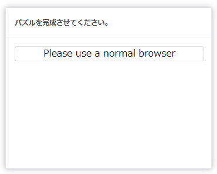

# 技術案

* [playwright](https://github.com/microsoft/playwright)
* node.js

# 検証-Booking No. Tracking
 

> **Note:** 今回検証したブッキング番号は全部[OOCL船会社](https://www.oocl.com/jpn/Pages/default.aspx)なので、その追跡サイトは制限がある。

## 問題点：

* 検証用のパズルがある為、全自動化することは難しい。

  

* `playwright/puppeteer`で`キャッシュ・キャッチ`などの認証状態を再利用する方法を試し、以下の状態に止まってしまった。
  * playwrightで作る仮想ブラウザーでhtml5 `<canvas>` 要素うまくローディングできない。

  

## できること:

  
  
# 検証-Container No. Tracking
