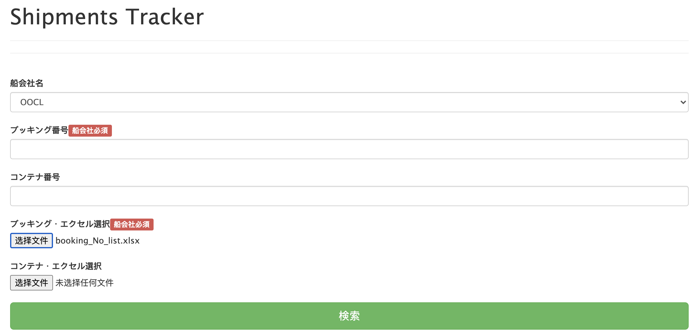
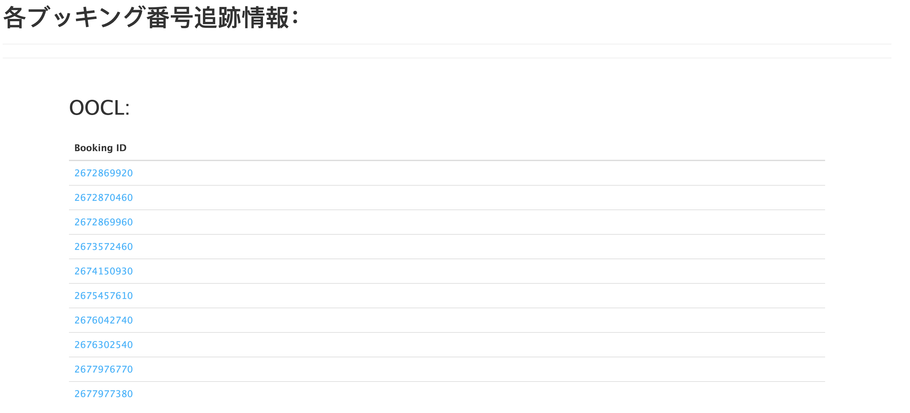
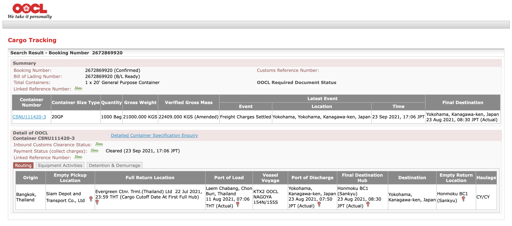
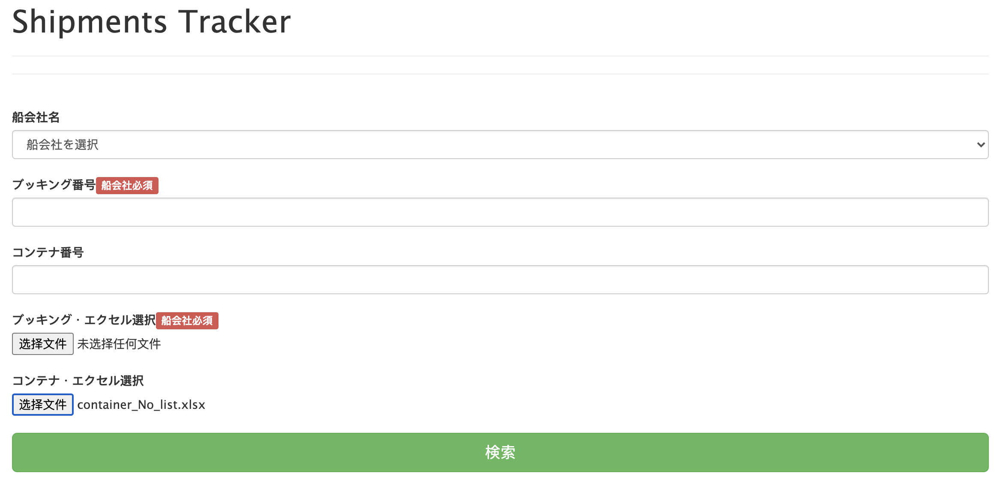
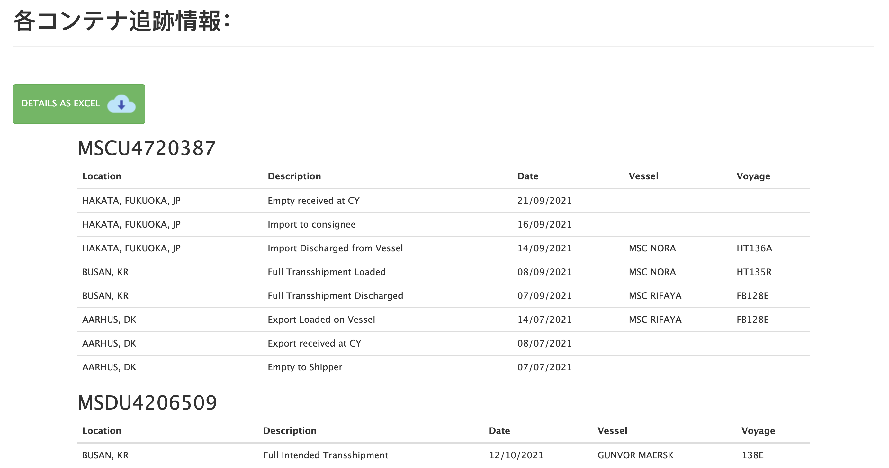

# 技術案

* [playwright](https://github.com/microsoft/playwright)
* node.js

# 検証-Booking No. Tracking
 

> **Note:** 今回検証したブッキング番号は全部[OOCL船会社](https://www.oocl.com/jpn/Pages/default.aspx)なので、その追跡サイトは制限がある。

## 問題点：

* 検証用のパズルがある為、全自動化することは難しい。

  

* `playwright/puppeteer`で`キャッシュ・キャッチ`などの認証状態を再利用する方法を試し、以下の状態に止まってしまった。
  * playwrightで作る仮想ブラウザーでhtml5 `<canvas>` 要素うまくローディングできない。

  

## できること:

* index page(ブッキング番号リスト`エクセル・ファイル（ex. booking_No_list.xlsx）`をアップロード)

  

* ブッキング番号のリンクリストを作る(各番号は[OOCL船会社追跡サイト](https://www.oocl.com/jpn/Pages/default.aspx)にアクセスでき)
  > **Note:** 第一回目にアクセスする時のみ、パズルの手作業が必要

  
  
* ブッキング番号の追跡情報  

  

# 検証-Container No. Tracking
 

> **Note:** [MSCコンテナ追跡サイト](https://www.msc.com/track-a-shipment?agencyPath=gbr)にアクセスし、ウェッブ・クローリングを行う。

## 問題点：

* 同一のコンテナ番号を頻繁に上記のサイトにアクセスする場合、ブラックリストに載る可能性がある。

## できること：

* index page(コンテナ番号リスト`エクセル・ファイル（ex. container_No_list.xlsx）`をアップロード)

  
  
* 各コンテナ番号の追跡情報

  
